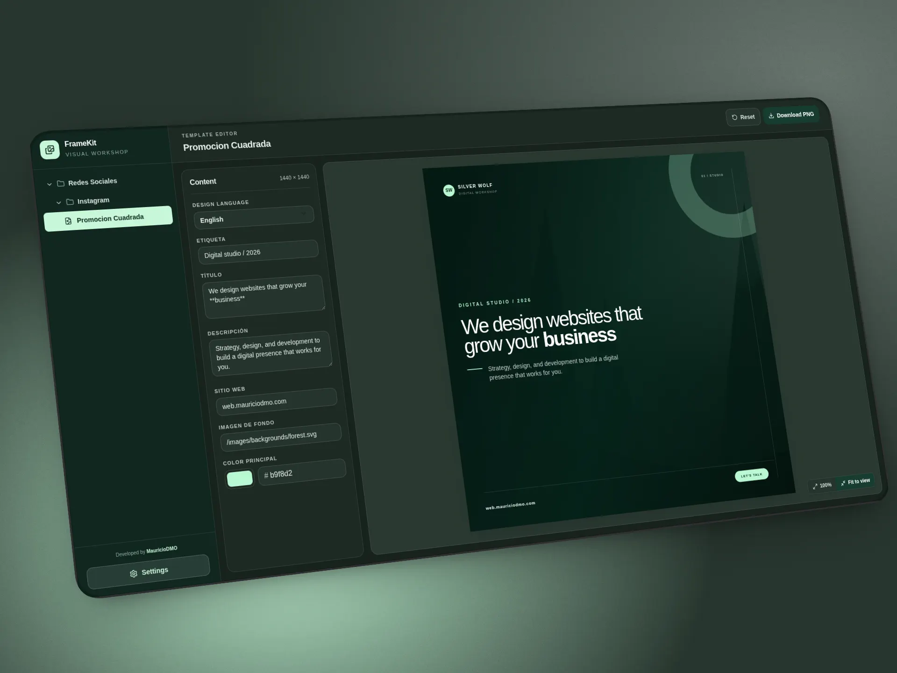

# FrameKit

**Create consistent visual content from React templates, not from repetitive manual edits.**

FrameKit is a template-based image editor for React and Next.js. Define the artwork once in code, expose only the content that should change, and let Studio preview, validate, and export the result at its declared dimensions.

[Español](README.es.md)

**Status: beta**

## What problem does it solve?

Social posts, campaign cards, and other recurring graphics often turn into a loop of duplicated layouts, copy-pasted files, and manual corrections. FrameKit gives teams one typed source of truth for the visual design and a focused editing surface for content variants.

The result is a repeatable workflow: developers own the template and its constraints; content editors change text, colors, URLs, and locales in Studio; the browser exports the finished PNG without rebuilding the design by hand.

## Studio

Studio is the visual workspace for browsing templates, editing their fields, switching content locales, and checking the final composition before export.



## Install and run

Create a project with the CLI:

```bash
pnpm dlx @mauriciodmo/create-framekit my-project
cd my-project
pnpm dev
```

The creator copies a working Next.js project, asks whether to install dependencies, generates the template registry, and can initialize Git. The development server opens FrameKit Studio with `pnpm dev`.

## A rendered template

A template defines its dimensions, editable fields, content variants, and React renderer. The following example renders a social card with localized content and Markdown text:

```tsx
import { defineTemplate, fields, Markdown } from '@mauriciodmo/framekit'

export default defineTemplate({
  width: 1200,
  height: 630,
  fields: {
    title: fields.textarea({ label: 'Title', required: true }),
    accent: fields.color({ label: 'Accent', defaultValue: '#b9f8d2' }),
  },
  content: {
    en: { language: 'English', title: 'Build once. **Publish often.**' },
    es: { language: 'Español', title: 'Diseña una vez. **Publica siempre.**' },
  },
  render({ data, width, height }) {
    return (
      <article style={{ width, height, background: '#10271f', color: data.accent }}>
        <Markdown value={data.title} />
      </article>
    )
  },
})
```

Studio renders this React node in the preview and exports a PNG named after the template slug, using the declared `1200×630` dimensions.

## Current capabilities

- Typed templates with `defineTemplate` or reusable `defineTemplateBase` definitions.
- Editable `text`, `textarea`, `number`, `color`, and `url` fields with defaults and validation.
- Arbitrary content variants such as `en`, `es`, or product-specific variants.
- Markdown rendering for inline text formatting and basic lists.
- Template discovery under `src/templates/**/template.tsx` and generated registries.
- Studio navigation, locale switching, light/dark theme, local browser persistence, preview zoom, and pan.
- CLI commands for `generate`, `check`, `dev`, `build`, and `start`.
- Client-side PNG export at the template's declared width and height.

## Known limitations

- Beta software: APIs and generated project details may change between releases.
- Export currently supports PNG only. There is no server-side rendering, GIF/video export, alternate image format, scale, or DPI control.
- Studio stores edits in the browser's `localStorage`; there is no account, server sync, or collaboration layer.
- Templates must live under `src/templates` and use a `template.tsx` entry file. The CLI does not currently provide an alternate templates directory or configuration file.
- The Studio interface is localized to English and Spanish. Template content can define its own locale keys.
- The package is ESM-only and does not provide CommonJS exports.

## Compatibility

| Dependency | Supported versions |
| ---------- | ------------------ |
| Node.js    | `>=22.13.0`        |
| React      | `>=19 <20`         |
| React DOM  | `>=19 <20`         |
| Next.js    | `>=16 <17`         |
| pnpm       | `>=11.14.0`        |

## Links

- [Documentation](Docs/en/README.md)
- [Documentación](Docs/es/README.md)
- [@mauriciodmo/framekit package README](packages/framekit/README.md)
- [License](LICENSE)

For repository development: `pnpm install --frozen-lockfile && pnpm dev`
