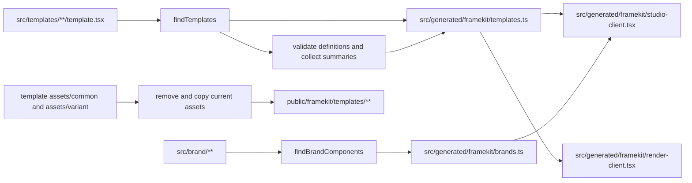

# Generated code

Generated files connect a consumer project's maintained source to the public
Studio and server boundaries. They are integration output, not a second
authoring implementation.

## Generation flow



`writeTemplateModule` performs this flow for a project root:

1. It discovers directories under `src/templates/` that contain
   `template.tsx`, turns their path segments into a slash-separated slug, and
   sorts the discovered templates by slug.
2. It executes a temporary summary module with `tsx`, validates each definition,
   and records metadata, dimensions, variants, and the declared content-key
   order.
3. It writes the `templates` registry with lazy loaders, the brand registry,
   and the generated Studio and render client bindings.
4. It discovers image assets, removes the previous
   `public/framekit/templates/` tree, copies the current files, and records the
   generated asset URLs in each registry entry.

Brand directories with a `component.tsx` are registered when they also provide
`preview.tsx` and a descriptive `README.md`. The generated brand module keeps
metadata and lazy preview loaders separate from the maintained component source.

## Generated paths

The canonical generated project contains:

```text
src/generated/framekit/
├── brands.ts
├── render-client.tsx
├── studio-client.tsx
└── templates.ts

public/framekit/templates/
└── <template-slug>/...
```

`templates.ts` contains `TemplateRegistryEntry` metadata, assets, and lazy
definition loaders. `studio-client.tsx` binds the registries to
`FrameKitStudio`; `render-client.tsx` binds the template registry to
`createRenderClient`. These client graphs are intentionally separate: the
render client does not import Studio or the brand registry.

Asset files are copied only from the supported template asset directories. The
generated public tree can be deleted and rebuilt. Other public files are not
removed by this synchronization.

## When output changes

Generation runs in these places:

- `framekit generate` runs it explicitly.
- `framekit check` generates before validation.
- `framekit build` runs `check`, so it generates before the Next.js build.
- `framekit dev` generates once before starting and watches `src/templates` and
  `src/brand` for changes.
- `framekit start` reads the existing production output and does not generate.

Generated output is ignored and disposable. Change `template.tsx`, brand source,
or maintained asset files, then regenerate. Do not edit
`src/generated/framekit/`, `public/framekit/`, `.framekit/`, or build output by
hand. The [generated files reference](/en/users/reference/generated-files) lists
the consumer-facing paths, and the [template registry reference](/en/users/concepts/templates/generated-registry)
describes the registry entry shape.
