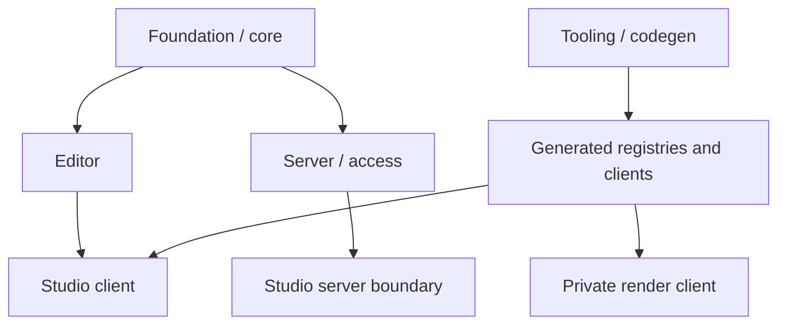

# FrameKit architecture

This guide is for contributors changing FrameKit itself. It explains where
behavior lives, which workspace owns it, and which files are generated. Start
with [local development](/en/contributors/getting-started/local-development) if
you have not installed the repository yet.

## Read the map

| Page | What it covers |
| --- | --- |
| [Repository architecture](/en/contributors/architecture/repository) | The monorepo layout, workspace ownership, operational knowledge, and import boundaries. |
| [Package architecture](/en/contributors/architecture/packages) | Public packages, the first-party Studio, the docs site, and published entrypoints. |
| [Generated code](/en/contributors/architecture/generated-code) | Discovery, registries, generated clients, copied assets, and maintained source. |
| [Studio and Editor](/en/contributors/architecture/studio-and-editor) | The client/editor boundary, Studio composition, and the export path. |
| [Server and access](/en/contributors/architecture/server-and-access) | SQLite access, sessions, tokens, authorization, and server-side rendering. |
| [Tooling and codegen](/en/contributors/architecture/tooling-and-codegen) | Discovery, code generation, the development server, and CLI lifecycle. |

## Layer map

The reusable package exposes the contracts that consumer applications use. The
first-party Studio and a generated project assemble those contracts rather than
importing package source files directly.

The layers have different runtime roles:

- **Foundation and core** define template types, fields, data resolution, and
  validation.
- **Editor** renders a definition into a canvas, provides controls and state,
  and starts export actions.
- **Studio** adds navigation, brand previews, settings, localization, and the
  server-side page boundary around the client UI.
- **Server and access** handle Node-only HTTP routes, SQLite-backed identity,
  image input preparation, jobs, and Chromium rendering.
- **Tooling and codegen** discover source directories, write project-local
  bindings, watch development files, and implement the CLI.

## Workspace map

The current workspaces are:

| Workspace | Ownership | Runtime or publication role |
| --- | --- | --- |
| `apps/studio/` | First-party Studio routes, application integration, templates, and assets. | Private Next.js application using the public FrameKit package. |
| `apps/docs/` | Astro and Starlight configuration and published Markdown content. | Private documentation workspace. |
| `packages/framekit/` | Reusable runtime, Editor and Studio components, server/access code, codegen, dev server, and `framekit` CLI. | Public `@mauriciodmo/framekit` package. |
| `packages/create-framekit/` | Project creator CLI and its canonical consumer template. | Public `@mauriciodmo/create-framekit` package. |

`Docs/Plans/` and `Docs/skills/` are operational repository knowledge, not
published workspaces. `Docs/Plans/` tracks implementation and documentation
work. `Docs/skills/` is the canonical source for skills that are synchronized to
repository and template copies.

## Follow a change

Choose the workspace that owns the behavior before changing code. If the change
touches generated consumers or a public entrypoint, trace it through the
corresponding generated project and public export. The [package architecture
page](/en/contributors/architecture/packages) lists those exports, while the
[generated code page](/en/contributors/architecture/generated-code) explains
which outputs must be regenerated instead of edited.
