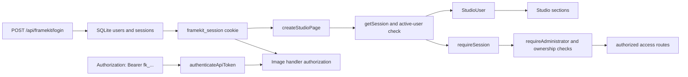

# Server and access architecture

The `@mauriciodmo/framekit/server` entrypoint is Node/server-only. It exposes
the HTTP handlers and the rendering primitives that the App Router routes bind
to a generated template registry.

## API boundary

The canonical route in the first-party app and generated template is a Node.js,
dynamic catch-all route. It creates one `createFrameKitApiHandler(templates)`
and exports it for `GET`, `POST`, `PATCH`, and `DELETE`.

The handler has two branches:

- `POST /api/framekit/images/render` goes to the image handler.
- Other supported `/api/framekit/...` paths go to the access handler, which
  matches exact paths and methods before invoking a route handler.

Cookie-authenticated mutations require a same-origin request. Authorization is
performed server-side; hiding a control in the client does not grant access.

## SQLite access model

The access layer opens SQLite lazily and runs the current schema migration. The
default database path is `.framekit-data/framekit.sqlite`;
`FRAMEKIT_DATABASE_PATH` can select another path or `:memory:` for a process.
The connection enables foreign keys, WAL mode, and a busy timeout.

The schema currently contains:

- `users`, with `admin` and `user` roles and an active flag;
- `sessions`, which stores a hash of each session secret and its expiry; and
- `api_tokens`, which stores token metadata, a token hash, last use, and
  revocation state.

On the first login against an empty database, `FRAMEKIT_ADMIN_PASSWORD` and the
optional `FRAMEKIT_ADMIN_USERNAME` bootstrap the first active administrator.
Passwords are hashed before storage. The database returns a safe
`StudioUser` DTO, not password or token secrets.

## Sessions, tokens, and authorization

Sessions are 30-day records. The client receives only the user id, username,
and role. A session for an expired, inactive, or deleted user is rejected.

API token secrets begin with `fk_`. The full secret is returned only when the
token is created; SQLite stores its hash and later listings expose metadata
only. An active owner can use an unrevoked token. A normal user can manage its
own tokens, while an administrator can manage users and inspect or revoke
another user's token metadata.

The protected Studio sections are `/editor`, `/brand`, and `/settings`. The
login page renders when no valid session exists and redirects an existing
session to `/editor`. Access route details belong in the [access API reference](/en/users/reference/http-api/access)
and the [account guide](/en/users/guides/manage-account-and-tokens).

## Server-side image rendering

The image handler authenticates before reading the request body or loading a
template. It then parses the render request, loads the matching registry entry,
prepares field data and image inputs, resolves the canonical template data, and
calls `renderTemplateImage`.

`renderTemplateImage` reserves bounded render capacity, creates an in-memory
render job with a short-lived identifier and token, opens a headless Chromium
context at the template dimensions, and navigates only to the private render
route. The route accepts the job token in
`x-framekit-render-token`, resolves the payload, and renders through the
generated client. Chromium waits for the ready marker and image decoding before
capturing one PNG root. The job, page, context, and capacity lease are cleaned
up afterward.

The image response is `image/png` with no-store behavior. Remote image inputs
are prepared and constrained before Chromium loads them. See [image rendering](/en/users/reference/http-api/image-render)
for the supported request and error contract.
