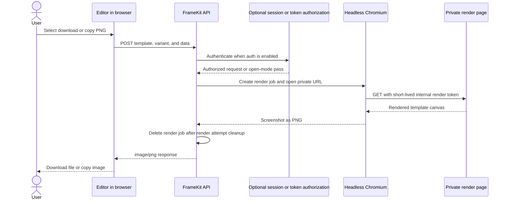

# Studio and Editor architecture

Studio is a composition of a server page boundary and a client UI. The Editor
is the reusable client surface inside that UI. The first-party app and a
generated consumer provide the same small App Router route shape and connect it
to generated client bindings.

## Route and client boundary

The catch-all Studio page imports `createStudioPage` from the public
`@mauriciodmo/framekit/studio/root` entrypoint and passes it the generated
`StudioClient`. The single auth switch is `FRAMEKIT_AUTH_ENABLED`. When it is
missing or `false`, the server factory:

- accepts only the `editor`, `brand`, and `settings` sections;
- renders `editor` and `brand` without a session;
- redirects `/login` to `/editor`; and
- returns `/settings` as not found. It does not initialize the access database.

When it is `true`, the factory reads the `framekit_session` cookie and resolves
it through the server access layer, redirects an unresolved session to `/login`,
and passes only `StudioUser { id, username, role }` to the client.

`FrameKitStudio` then derives the section from the pathname. It builds template
navigation from the generated template registry, brand navigation from the
generated brand registry, and settings from the authenticated user when that
route exists. Selected templates and brand previews are loaded through their
registry loaders.

## Editor responsibilities

`FrameKitEditor` receives one registry entry and its validated definition. It
uses the core resolver and validator to produce render data, then composes:

- variant selection and field controls;
- a `TemplateCanvas` that calls the template's `render` function with resolved
  data, assets, variant, width, and height;
- browser-local Editor state keyed by `framekit:<slug>:v2`; and
- metadata, download, and copy actions.

The canvas is a local editing preview. It is not the source of the PNG export.
The download and copy actions post the current template slug, variant, and
edits to `/api/framekit/images/render`. Structured server validation errors are
mapped back to the corresponding Editor fields.

Brand components are a separate Studio surface. A brand entry loads its
generated preview and description; contributors edit the maintained component
and preview source rather than the generated brand module.

## Export flow

The API creates an in-memory render job with a short TTL and passes Chromium a
private URL plus a short-lived internal render token. The render page calls
`loadRenderRequest()` to validate the token and read the payload; that lookup is
non-destructive, so the job remains available while rendering runs.

`renderTemplateImage()` deletes the job in its cleanup path after the render
attempt ends; expired jobs are also pruned. The token is short-lived, but it is
not consumed by `loadRenderRequest()`.

The server-backed path is described in [Render images with the API](/en/users/guides/render-images-with-the-api).
The [Studio guide](/en/users/guides/use-studio) covers the user workflow; this
page is concerned with the boundaries contributors change.
