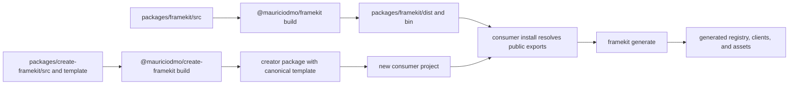

# Tooling and codegen architecture

Tooling turns maintained project source into the registries and bindings used
by Studio and private rendering. It also owns the development server and the
`framekit` command lifecycle.

## Discovery and codegen

Discovery is filesystem-based:

- `findTemplates` walks `src/templates/` and registers a directory when it
  contains `template.tsx`.
- `findBrandComponents` walks `src/brand/` and registers a component directory
  with `component.tsx`, `preview.tsx`, and `README.md`.
- `findTemplateAssets` reads supported image files from each template's
  `assets/common/` and variant directories.

The codegen module writes the registry and generated clients in one operation.
It validates summaries by executing template modules in a temporary directory,
creates lazy loaders for the generated registries, and synchronizes the public
asset tree. See [Generated code](/en/contributors/architecture/generated-code)
for the output contract.

## Development server

`framekit dev` creates the development server for the current working
directory. It:

1. generates the registry before starting Next.js with Turbopack;
2. adds a small Node HTTP server in front of the Next request handler;
3. handles the development-only `/framekit/assets` upload path with a valid
   same-origin session; and
4. watches `src/templates` and `src/brand`, scheduling regeneration for file
   and directory changes.

Generation requests are coalesced while one generation is already running. The
server closes the watcher, generator, HTTP server, and Next app together.

## CLI lifecycle

The `framekit` binary uses `process.cwd()` as the project root and supports:

| Command | Responsibility |
| --- | --- |
| `framekit generate` | Discover source and write registries, clients, and copied assets. |
| `framekit check` | Generate, then validate every definition and resolved content variant. |
| `framekit dev` | Generate, watch source, and run the development server. |
| `framekit build` | Check, run `next build`, and prepare standalone output and required assets. |
| `framekit start` | Run the existing standalone server without generation. |
| `framekit browser install [--with-deps]` | Install the Chromium headless shell used by server-side rendering. |

The [CLI reference](/en/users/reference/cli/framekit) documents the consumer
contract. Contributors should keep command behavior aligned with the package
manifest, the generated template, and the CLI tests.

## Package build to generated consumer

The public package build produces the `dist/` files addressed by its exports.
The creator package carries the canonical template. When a consumer project is
created and its dependencies are installed, the project runs `framekit
generate` to create the project-local bindings.

The generated consumer imports public package entrypoints and its own generated
modules. A package build does not make generated project output a maintained
source tree; generation remains the consumer project's reproducible step.
