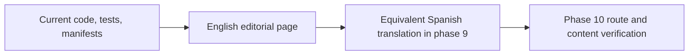

# Translations and Mermaid

This page is for contributors maintaining the documentation's editorial and
diagram conventions. Its primary responsibility is to keep localization and
visual explanations faithful to the current English source.

## English is the editorial source

English pages under `apps/docs/src/content/docs/en/` are the editorial source.
Spanish is an equivalent translation to prepare in phase 9, not a second source
of technical truth.

Do not create Spanish pages or claim `/en/` and `/es/` parity as part of this
phase. When phase 9 localizes a page, preserve its slug and primary
responsibility. Translate the prose and visible labels, but keep API names,
package names, commands, flags, routes, variables, file paths, and code
contracts exact.

Every locale must describe the current contract, not a historical one. Check
manifests, implementation, tests, and the canonical template before carrying a
claim into a translation. Legacy `Docs/en/` and `Docs/es/` pages are migration
context, while `Docs/Plans/` and `Docs/skills/` remain operational repository
knowledge rather than published pages or translation targets.

Use explicit locale-prefixed links: English pages link to `/en/...`, and future
Spanish equivalents link to `/es/...`. Do not use relative links or bare paths
that can silently cross locales.

## Use Mermaid for relationships

The docs site enables Mermaid through `astro-mermaid` in
`apps/docs/astro.config.mjs`. Use a diagram only when a relationship, flow, or
dependency is clearer as a visual than as prose or a table. Do not add Mermaid
for decoration, for a short list, or where numbered steps explain the order
more clearly.

This relationship is a useful example of a diagram because it shows source,
translation, and rollout ownership without pretending that localization is
already complete:



Keep the surrounding prose authoritative. Use short labels, include the
important relationship in text as well, and ensure the diagram does not
introduce an unsupported route, command, or behavior. A Mermaid block is still
published content and must follow the same source-verification rules as a code
example.

## Check localized diagrams

When adding or changing Mermaid, build the docs site from the repository root:

```bash
pnpm --filter docs build
```

Review the rendered page for readable labels and a useful relationship on both
desktop and mobile. Phase 9 owns Spanish equivalents; phase 10 owns the final
route, content, and deployment verification. Keep those gates separate from
the English maintenance change.
