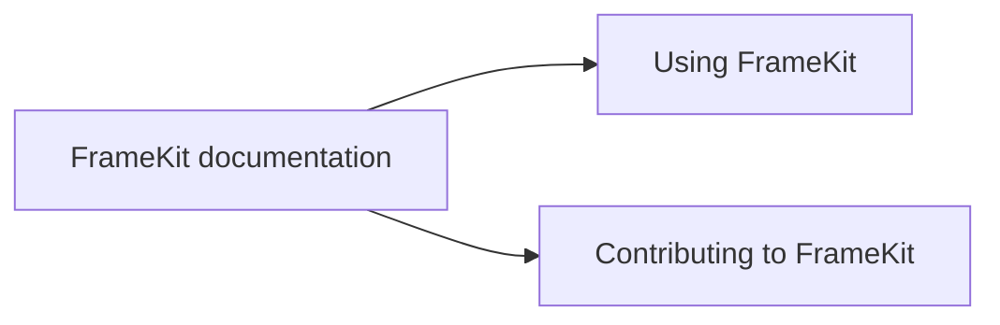

FrameKit documentation is organized around two audiences. Choose the path that matches what you are doing with the project.

## Choose your path

- [Using FrameKit](/en/users/): Learn how to build image editing experiences with the visual Studio, CLI, and generated React or Next.js projects.
- [Contributing to FrameKit](/en/contributors/): Orient yourself in the repository and the work involved in improving FrameKit and its documentation.

