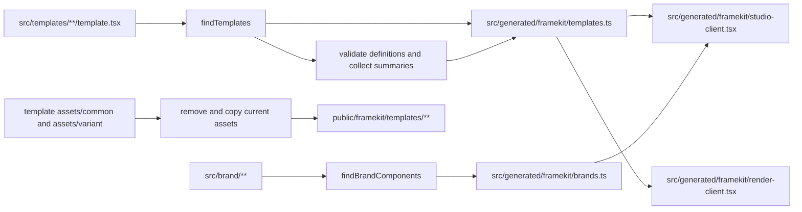

# Código generado

Los archivos generados conectan el código fuente mantenido de un proyecto consumidor con los límites públicos de Studio y del servidor. Son salida de integración, no una segunda implementación de autoría.

## Flujo de generación



`writeTemplateModule` realiza este flujo para la raíz de un proyecto:

1. Descubre directorios bajo `src/templates/` que contienen `template.tsx`, convierte sus segmentos de ruta en un slug separado por barras y ordena las plantillas descubiertas por slug.
2. Ejecuta un módulo temporal de resumen con `tsx`, valida cada definición y registra los metadatos, las dimensiones, las variantes y el orden declarado de las claves de contenido (`content-key`).
3. Escribe el registro `templates` con cargadores diferidos, el registro de marcas y las vinculaciones generadas de Studio y render.
4. Descubre los assets de imagen, elimina el árbol anterior de `public/framekit/templates/`, copia los archivos actuales y registra las URL de assets generadas en cada entrada del registro.

Los directorios de marca con un `component.tsx` se registran cuando también proporcionan `preview.tsx` y un `README.md` descriptivo. El módulo de marca generado mantiene separados los metadatos y los cargadores diferidos de vistas previas del código fuente del componente mantenido.

## Rutas generadas

El proyecto generado canónico contiene:

```text
src/generated/framekit/
├── brands.ts
├── render-client.tsx
├── studio-client.tsx
└── templates.ts

public/framekit/templates/
└── <template-slug>/...
```

`templates.ts` contiene metadatos de `TemplateRegistryEntry`, assets y cargadores diferidos de definiciones. `studio-client.tsx` vincula los registros con `FrameKitStudio`; `render-client.tsx` vincula el registro de plantillas con `createRenderClient`. Estos grafos de cliente están separados intencionalmente: el cliente de render no importa Studio ni el registro de marcas.

Los archivos de assets se copian únicamente desde los directorios de assets de plantilla compatibles. El árbol público generado se puede eliminar y regenerar. Otros archivos públicos no se eliminan durante esta sincronización.

## Cuándo cambia la salida

La generación se ejecuta en estos lugares:

- `framekit generate` la ejecuta explícitamente.
- `framekit check` genera antes de la validación.
- `framekit build` ejecuta `check`, por lo que genera antes de la compilación de Next.js.
- `framekit dev` genera una vez antes de iniciar y observa `src/templates` y `src/brand` para detectar cambios.
- `framekit start` lee la salida de producción existente y no genera.

La salida generada se ignora y es desechable. Cambia `template.tsx`, el código fuente de la marca o los archivos de assets mantenidos y vuelve a generar. No edites manualmente `src/generated/framekit/`, `public/framekit/`, `.framekit/` ni la salida de compilación. La [referencia de archivos generados](/es/users/reference/generated-files) enumera las rutas orientadas al consumidor, y la [referencia del registro de plantillas](/es/users/concepts/templates/generated-registry) describe la forma de las entradas del registro.
