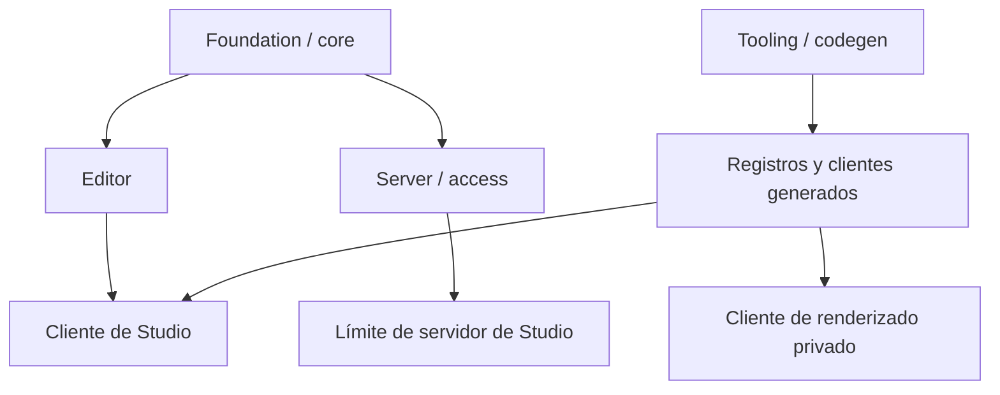

# Arquitectura de FrameKit

Esta guía está dirigida a quienes modifican el propio FrameKit. Explica dónde
reside el comportamiento, qué workspace es responsable de él y qué archivos se
generan. Comienza con [desarrollo local](/es/contributors/getting-started/local-development) si aún no has instalado el repositorio.

## Consulta el mapa

| Página | Qué cubre |
| --- | --- |
| [Arquitectura del repositorio](/es/contributors/architecture/repository) | La disposición del monorepo, la responsabilidad de cada workspace, el conocimiento operativo y los límites de importación. |
| [Arquitectura de paquetes](/es/contributors/architecture/packages) | Los paquetes públicos, el Studio de primera parte, el sitio de documentación y los puntos de entrada publicados. |
| [Código generado](/es/contributors/architecture/generated-code) | El descubrimiento, los registros, los clientes generados, los recursos copiados y el código mantenido. |
| [Studio y Editor](/es/contributors/architecture/studio-and-editor) | El límite entre el cliente y el editor, la composición de Studio y la ruta de exportación. |
| [Servidor y acceso](/es/contributors/architecture/server-and-access) | El acceso opcional a SQLite, las sesiones, los tokens, la autorización y el renderizado del lado del servidor. |
| [Herramientas y codegen](/es/contributors/architecture/tooling-and-codegen) | El descubrimiento, la generación de código, el servidor de desarrollo y el ciclo de vida de la CLI. |

## Mapa de capas

El paquete reutilizable expone los contratos que usan las aplicaciones
consumidoras. El Studio de primera parte y un proyecto generado ensamblan esos
contratos en lugar de importar directamente los archivos de origen del paquete.

Las capas tienen distintos roles en tiempo de ejecución:

- **Foundation y core** definen los tipos de plantillas, los campos, la resolución de datos y la validación.
- **Editor** representa una definición en un canvas, proporciona controles y estado, e inicia las acciones de exportación.
- **Studio** añade navegación, previsualizaciones de marca, configuración, localización y el límite de página del lado del servidor alrededor de la interfaz de cliente.
- **Server y access** gestionan las rutas HTTP exclusivas de Node, la identidad opcional respaldada por SQLite, la preparación de entradas de imagen, los trabajos y el renderizado con Chromium.
- **Tooling y codegen** descubren directorios de origen, escriben bindings locales al proyecto, observan los archivos de desarrollo e implementan la CLI.

## Mapa de workspaces

Los workspaces actuales son:

| Workspace | Responsabilidad | Rol de runtime o publicación |
| --- | --- | --- |
| `apps/studio/` | Rutas de Studio de primera parte, integración de la aplicación, plantillas y recursos. | Aplicación privada de Next.js que usa el paquete público de FrameKit. |
| `apps/docs/` | Configuración de Astro y Starlight y contenido Markdown publicado. | Workspace privado de documentación. |
| `packages/framekit/` | Runtime reutilizable, componentes de Editor y Studio, código de servidor y acceso, codegen, servidor de desarrollo y CLI `framekit`. | Paquete público `@mauriciodmo/framekit`. |
| `packages/create-framekit/` | CLI de creación de proyectos y su plantilla canónica para consumidores. | Paquete público `@mauriciodmo/create-framekit`. |

`Docs/Plans/` y `Docs/skills/` contienen conocimiento operativo del repositorio,
no son workspaces publicados. `Docs/Plans/` registra el trabajo de implementación
y documentación. `Docs/skills/` es la fuente canónica de las skills que se
sincronizan con las copias del repositorio y de la plantilla.

## Sigue un cambio

Elige el workspace responsable del comportamiento antes de modificar el código.
Si el cambio afecta a consumidores generados o a un punto de entrada público,
trázalo a través del proyecto generado correspondiente y de la exportación
pública. La [página de arquitectura de paquetes](/es/contributors/architecture/packages)
enumera esas exportaciones, mientras que la [página de código generado](/es/contributors/architecture/generated-code)
explica qué salidas deben regenerarse en lugar de editarse.
