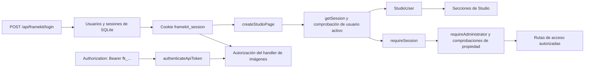

# Arquitectura del servidor y del acceso

El punto de entrada `@mauriciodmo/framekit/server` está disponible únicamente en el
servidor Node. Expone los handlers HTTP y las primitivas de renderizado que las rutas
de App Router conectan con un registro de plantillas generado.

## Límite de la API

La ruta canónica en la aplicación de primera parte y en la plantilla generada es una
ruta catch-all dinámica de Node.js. Crea un único `createFrameKitApiHandler(templates)`
y lo exporta para `GET`, `POST`, `PATCH` y `DELETE`.

El handler tiene dos ramas:

- `POST /api/framekit/images/render` va al handler de imágenes.
- Las demás rutas compatibles `/api/framekit/...` van al handler de acceso cuando
  `FRAMEKIT_AUTH_ENABLED=true`, que busca las rutas y los métodos exactos antes
  de invocar un handler de ruta. En modo abierto, esas rutas no existen.

Las mutaciones que usan autenticación mediante cookies requieren una solicitud del mismo
origen. La autorización se realiza en el servidor cuando está activada; ocultar un control
en el cliente no concede acceso.

## Modelo de acceso a SQLite

La capa de acceso abre SQLite de forma diferida y ejecuta la migración de esquema
actual solo cuando `FRAMEKIT_AUTH_ENABLED=true`. La ruta de base de datos predeterminada
es `.framekit-data/framekit.sqlite`; `FRAMEKIT_DATABASE_PATH` puede seleccionar otra
ruta o `:memory:` para un proceso. El modo abierto no inicializa SQLite.
La conexión habilita las claves foráneas, el modo WAL y un tiempo de espera cuando
SQLite está ocupado.

El esquema contiene actualmente:

- `users`, con los roles `admin` y `user`, y un indicador de actividad;
- `sessions`, que almacena un hash de cada secreto de sesión y su expiración; y
- `api_tokens`, que almacena metadatos del token, un hash del token, su último uso
  y su estado de revocación.

Con la autenticación activada, en la primera solicitud de inicio de sesión contra una base
de datos vacía, `FRAMEKIT_ADMIN_PASSWORD` y el `FRAMEKIT_ADMIN_USERNAME` opcional
inicializan el primer administrador activo. Si no se define `FRAMEKIT_ADMIN_USERNAME`, el
valor predeterminado es `admin`. Las contraseñas se almacenan como hashes. La base de datos
devuelve un DTO `StudioUser` seguro, no los secretos de contraseñas ni de tokens.

## Sesiones, tokens y autorización

Las sesiones tienen una vigencia de 30 días cuando la autenticación está activada. El cliente solo recibe el id, el nombre
de usuario y el rol. Se rechaza una sesión expirada o asociada a un usuario inactivo
o eliminado.

Los secretos de los tokens de API comienzan por `fk_`. El secreto completo se
devuelve únicamente cuando se crea el token; SQLite almacena su hash y los listados
posteriores solo exponen metadatos. Un propietario activo puede usar un token no
revocado. Un usuario normal puede gestionar sus propios tokens, mientras que un
administrador puede gestionar usuarios e inspeccionar los metadatos del token de otro
usuario o revocarlo.

Con la autenticación activada, las secciones protegidas de Studio son `/editor`, `/brand`
y `/settings`. La página de inicio de sesión se muestra cuando no existe una sesión válida;
si ya existe una, redirige a `/editor`. En modo abierto, `/editor` y `/brand` funcionan
sin sesión, `/login` redirige a `/editor` y `/settings` no existe. Los detalles de las rutas
de acceso se encuentran en
la [referencia de la API de acceso](/es/users/reference/http-api/access)
y en la [guía de la cuenta](/es/users/guides/manage-account-and-tokens).

## Renderizado de imágenes en el servidor

El handler de imágenes autentica la solicitud antes de leer el cuerpo de la
solicitud o cargar una plantilla cuando la autenticación está activada. En modo abierto
omite las credenciales, pero conserva la validación y el aislamiento. Después analiza la solicitud de renderizado, carga
la entrada correspondiente del registro, prepara los datos de campos y las
entradas de imagen, resuelve los datos canónicos de la plantilla y llama a
`renderTemplateImage`.

`renderTemplateImage` reserva una capacidad de renderizado acotada, crea un trabajo
de renderizado en memoria con un identificador y un token de corta duración, abre
un contexto de Chromium sin interfaz con las dimensiones de la plantilla y navega
únicamente a la ruta de renderizado privada. La ruta acepta el token del trabajo en
`x-framekit-render-token`, resuelve el payload y renderiza mediante el cliente
generado. Chromium espera el marcador de preparación y la decodificación de la
imagen antes de capturar un único PNG raíz. Después se limpian el trabajo, la
página, el contexto y la concesión de capacidad.

La respuesta de imagen es `image/png` y tiene comportamiento no-store. Las entradas
de imágenes remotas se preparan y restringen antes de que Chromium las cargue.
Consulta [renderizado de imágenes](/es/users/reference/http-api/image-render)
para conocer el contrato compatible de solicitud y errores.
