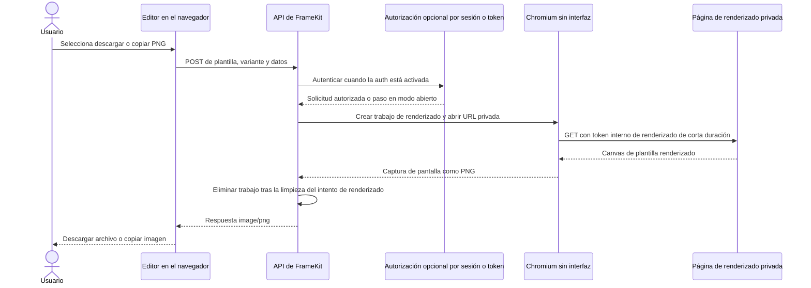

# Arquitectura de Studio y Editor

Studio es una composición de un límite de página del servidor y una UI cliente. Editor es la superficie cliente reutilizable dentro de esa UI. La aplicación de primera parte y un consumidor generado proporcionan la misma forma pequeña de ruta de App Router y la conectan con bindings de cliente generados.

## Límite de ruta y cliente

La página catch-all de Studio importa `createStudioPage` desde el entrypoint público `@mauriciodmo/framekit/studio/root` y le pasa el `StudioClient` generado. El único interruptor es `FRAMEKIT_AUTH_ENABLED`. Cuando falta o es `false`, la factory del servidor:

- acepta solo las secciones `editor`, `brand` y `settings`;
- renderiza `editor` y `brand` sin sesión;
- redirige `/login` a `/editor`; y
- devuelve `/settings` como no encontrado. No inicializa la base de datos de acceso.

Cuando es `true`, la factory lee la cookie `framekit_session` y la resuelve mediante
la capa de acceso del servidor, redirige una sesión no resuelta a `/login` y pasa
solo `StudioUser { id, username, role }` al cliente.

`FrameKitStudio` deriva entonces la sección a partir del pathname. Construye la navegación de plantillas a partir del registro de plantillas generado, la navegación de marca a partir del registro de marca generado y los ajustes a partir del usuario autenticado cuando esa ruta existe. Las plantillas seleccionadas y las vistas previas de marca se cargan mediante sus loaders de registro.

## Responsabilidades del Editor

`FrameKitEditor` recibe una entrada del registro y su definición validada. Usa el resolver del core para producir datos de renderizado y valida esos datos antes de exportar; luego compone:

- selección de variantes y controles de campos;
- un `TemplateCanvas` que llama a la función `render` de la plantilla con los datos resueltos, los assets, la variante, el ancho y el alto;
- estado de Editor local del navegador con la clave `framekit:<slug>:v2`; y
- acciones de metadatos, descarga y copia.

El canvas es una vista previa de edición local. No es la fuente de la exportación PNG. Las acciones de descarga y copia envían mediante POST el slug de la plantilla actual, la variante y las ediciones a `/api/framekit/images/render`. Los errores estructurados de validación del servidor se asignan de nuevo a los campos correspondientes del Editor.

Los componentes de marca son una superficie separada de Studio. Una entrada de marca carga su vista previa y descripción generadas; los colaboradores editan el componente mantenido y la fuente de la vista previa, no el módulo de marca generado.

## Flujo de exportación

La API crea un trabajo de renderizado en memoria con un TTL corto y proporciona a Chromium una URL privada junto con un token interno de renderizado de corta duración. La página de renderizado llama a `loadRenderRequest()` para validar el token y leer el payload; esa consulta no es destructiva, por lo que el trabajo sigue disponible mientras se ejecuta el renderizado.

`renderTemplateImage()` elimina el trabajo en su ruta de limpieza después de que termina el intento de renderizado; los trabajos expirados también se depuran. El token es de corta duración, pero `loadRenderRequest()` no lo consume.

La ruta respaldada por el servidor se describe en [Renderizar imágenes con la API](/es/users/guides/render-images-with-the-api). La [guía de Studio](/es/users/guides/use-studio) cubre el flujo de trabajo del usuario; esta página se centra en los límites que modifican los colaboradores.
