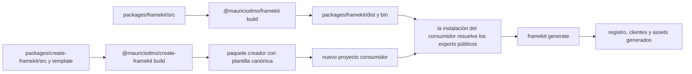

# Arquitectura de tooling y codegen

Las herramientas convierten el código fuente mantenido del proyecto en los
registros y bindings que usan Studio y el renderizado privado. También se
encargan del servidor de desarrollo y del ciclo de vida del comando `framekit`.

## Descubrimiento y codegen

El descubrimiento se basa en el sistema de archivos:

- `findTemplates` recorre `src/templates/` y registra un directorio cuando
  contiene `template.tsx`.
- `findBrandComponents` recorre `src/brand/` y registra un directorio de
  componentes con `component.tsx`, `preview.tsx` y `README.md`.
- `findTemplateAssets` lee los archivos de imagen compatibles de `assets/common/`
  y de los directorios de variantes de cada plantilla.

El módulo de codegen escribe el registro y los clientes generados en una sola
operación. Valida los resúmenes ejecutando módulos de plantilla en un directorio
temporal, crea cargadores diferidos para los registros generados y sincroniza el
árbol público de assets. Consulta [Código generado](/es/contributors/architecture/generated-code)
para conocer el contrato de salida.

## Servidor de desarrollo

`framekit dev` crea el servidor de desarrollo para el directorio de trabajo
actual. Hace lo siguiente:

1. genera el registro antes de iniciar Next.js con Turbopack;
2. añade un pequeño servidor HTTP de Node delante del gestor de solicitudes de Next;
3. gestiona la ruta de carga de desarrollo `/framekit/assets` con una sesión válida
   del mismo origen; y
4. observa `src/templates` y `src/brand` y programa una regeneración cuando cambian
   archivos o directorios.

Las solicitudes de generación se agrupan mientras ya hay una generación en curso.
El servidor cierra conjuntamente el observador, el generador, el servidor HTTP y
la aplicación de Next.

## Ciclo de vida de la CLI

El binario `framekit` usa `process.cwd()` como raíz del proyecto y admite:

| Comando | Responsabilidad |
| --- | --- |
| `framekit generate` | Descubrir el código fuente y escribir registros, clientes y assets copiados. |
| `framekit check` | Generar y validar cada definición y cada variante de contenido resuelta. |
| `framekit dev` | Generar, observar el código fuente y ejecutar el servidor de desarrollo. |
| `framekit build` | Comprobar, ejecutar `next build` y preparar la salida standalone y los assets necesarios. |
| `framekit start` | Ejecutar el servidor standalone existente sin generar. |
| `framekit browser install [--with-deps]` | Instalar el shell headless de Chromium usado para el renderizado del lado del servidor. |

La [referencia de la CLI](/es/users/reference/cli/framekit) documenta el
contrato para consumidores. Los colaboradores deben mantener el comportamiento
de los comandos alineado con el manifiesto del paquete, la plantilla generada y
las pruebas de la CLI.

## De la compilación del paquete al consumidor generado

La compilación del paquete público produce los archivos `dist/` a los que
apuntan sus exports. El paquete creador contiene la plantilla canónica. Cuando se
crea un proyecto consumidor y se instalan sus dependencias, el proyecto ejecuta
`framekit generate` para crear sus bindings locales.

El consumidor generado importa los entrypoints públicos del paquete y sus propios
módulos generados. No importa `packages/framekit/src/**`. Una compilación del
paquete no convierte la salida del proyecto generado en un árbol de código fuente
mantenido; la generación sigue siendo el paso reproducible del proyecto
consumidor.
