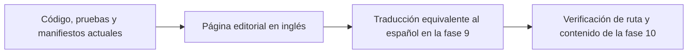

# Traducciones y Mermaid

Esta página es para quienes contribuyen al mantenimiento de las convenciones
editoriales y de diagramas de la documentación. Su responsabilidad principal es
mantener la localización y las explicaciones visuales fieles a la fuente actual
en inglés.

## El inglés es la fuente editorial

Las páginas en inglés bajo `apps/docs/src/content/docs/en/` son la fuente
editorial. El español es una traducción equivalente que se preparará en la fase
9, no una segunda fuente de verdad técnica.

No crees páginas en español ni afirmes la paridad entre `/en/` y `/es/` como
parte de esta fase. Cuando la fase 9 localice una página, conserva su slug y su
responsabilidad principal. Traduce la prosa y las etiquetas visibles, pero
mantén exactos los nombres de API, nombres de paquetes, comandos, flags, rutas,
variables, rutas de archivos y contratos de código.

Cada locale debe describir el contrato actual, no uno histórico. Comprueba los
manifiestos, la implementación, las pruebas y la plantilla canónica antes de
trasladar una afirmación a una traducción. Las páginas heredadas fuera del árbol
publicado son contexto de migración, mientras que `Docs/Plans/` y `Docs/skills/`
siguen siendo conocimiento operativo del repositorio, no páginas publicadas ni
objetivos de traducción.

Usa enlaces explícitos con prefijo de locale: las páginas en inglés enlazan a
`/en/...` y sus equivalentes futuros en español enlazan a `/es/...`. No uses
enlaces relativos ni rutas sin prefijo que puedan cruzar locales
silenciosamente.

## Usa Mermaid para las relaciones

El sitio de documentación habilita Mermaid mediante `astro-mermaid` en
`apps/docs/astro.config.mjs`. Usa un diagrama solo cuando una relación, un flujo
o una dependencia se entienda mejor visualmente que mediante prosa o una tabla.
No añadas Mermaid como decoración, para una lista breve ni cuando unos pasos
numerados expliquen el orden con mayor claridad.

Esta relación es un ejemplo útil de diagrama porque muestra la fuente, la
traducción y la responsabilidad del lanzamiento sin pretender que la
localización ya esté completa:



Mantén la prosa circundante como fuente de autoridad. Usa etiquetas breves,
incluye también la relación importante en el texto y asegúrate de que el
diagrama no introduzca una ruta, un comando o un comportamiento no respaldado.
Un bloque de Mermaid
sigue siendo contenido publicado y debe cumplir las mismas reglas de
verificación de fuentes que un ejemplo de código.

## Comprueba los diagramas localizados

Al añadir o cambiar Mermaid, compila el sitio de documentación desde la raíz
del repositorio:

```bash
pnpm --filter docs build
```

Revisa la página renderizada para comprobar que las etiquetas sean legibles y
que la relación sea útil tanto en escritorio como en dispositivos móviles. La
fase 9 se ocupa de los equivalentes en español; la fase 10 se ocupa de la
verificación final de la ruta, el contenido y el despliegue. Mantén esas
puertas separadas del cambio de mantenimiento en inglés.
